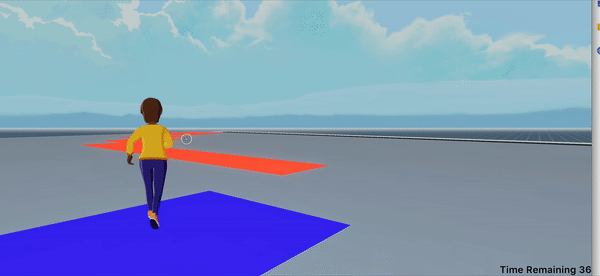

# Parcel Flipper

A multiplayer game with websockets, where the game logic is carried out server-side.



The server takes care of organizing players into teams and only starting a match when there are players on both sides.

Each scene runs its own calculations of the current remaining time and the scores of each team, but so does the server. In the end, the server has the final word about when the match is over and what is the final result.

## Run the game

To run this scene locally, you must first run the server

```
cd server
npm start
```

Then, keeping the server running, on a separate window, run the scene:

```
cd scene
dcl start
```

To fully play the game, open two separate browser windows, and direct one player to the Blue tile and another to the Red tile, so that there are players in both teams.

> Note: Because of a known issue with the scene preview, both players might end up with the same ID, and in that case the server will reject the second one's attempt to join a team, claiming that it is already joined. To prevent this, make sure you keep the loading of both instances of the game a couple of minutes apart, that seems to ensure they don't use the same ID.
